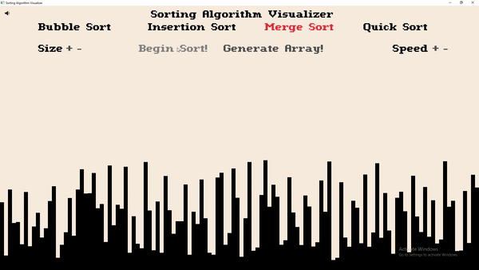
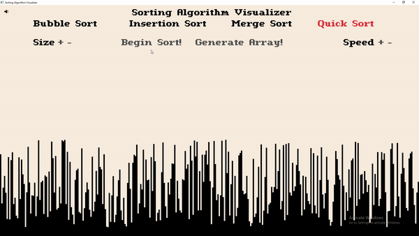
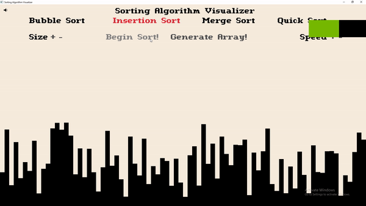
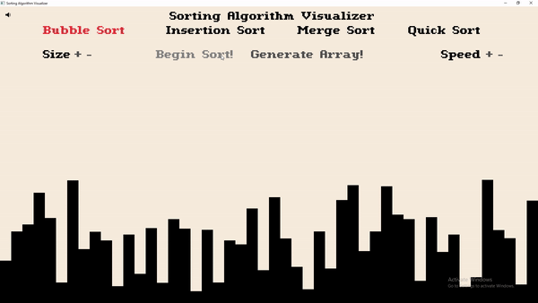

# sorting-algorithm-visualizer

Outline: This project visualizes the internal sorting processes for some of the most commonly known algorithms such as Bubble, Insertion, Merge, and Quick Sort written in C++. I utilize raylib, an open-source library to help create the responsive graphical interface that ultimately makes this app easy to use. Users have the freedom to tune the sorting to their liking by being able to change both the size and speed of sorting operations.

## Usage and Setup
1) To successfully run this project, you are going to need [raylib](https://github.com/raysan5/raylib) installed on your local machine. I have provided the link for your convenience and they have provided the relevant documentation on their GitHub for easy installation depending on your OS.
2) Running the program is as simple as typing ```make``` into a terminal pointing to the project directory which will compile the code into an executable named **game.exe** within the same directory or simply copy+paste the command at **build/Makefile** <br />
```g++ main.cpp -o game.exe -O2 -Wall -Wno-missing-braces -I /include -L lib/ -lraylib -lopengl32 -lgdi32 -lwinmm```

## Demo Samples
  <br/>
&emsp;&emsp;&emsp;&emsp;&emsp;&emsp;&emsp;&ensp;**merge sort**&emsp;&emsp;&emsp;&emsp;&emsp;&emsp;&emsp;&emsp;&emsp;&emsp;&emsp;&emsp;&emsp;&emsp; &emsp;&emsp;&ensp;**quick sort** <br/>
   <br/>
&emsp;&emsp;&emsp;&emsp;&emsp;&emsp;&ensp;&ensp;**insertion sort**&emsp;&emsp;&emsp;&emsp;&emsp;&emsp;&emsp;&emsp;&emsp;&emsp;&emsp;&emsp;&emsp;&emsp;&emsp;&ensp;**bubble sort** <br/>
